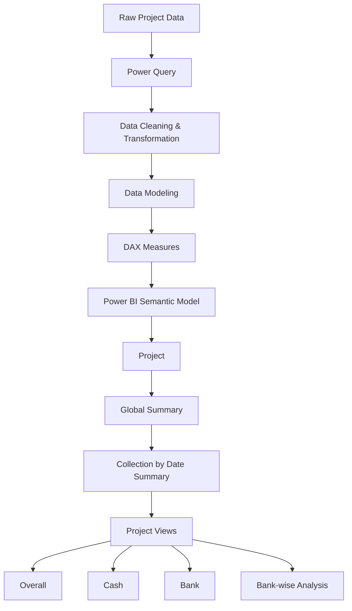

# 🏢 El-Morshedy Real Estate — Business-Intelligence

<p align="center">
  
</p>

<p align="center">
  <b>Data Analysis & Business Intelligence Graduation Project</b>
</p>

<p align="center">
 This project presents an end-to-end Business Intelligence solution developed using Microsoft Power BI.
</p>

---

## 📌 Project Overview

El-Morshedy Real Estate sells residential units across multiple projects using multi-year installment plans.

Before this project, sales and collection data were maintained separately for each project in Excel workbooks. This made it difficult to compare projects, monitor overdue installments, analyze payment channels, and obtain a consolidated view of the company's financial position.

This project consolidates **8 residential projects** into a unified Power BI analytical solution.

The dashboard provides a guided, self-service environment to analyze:

- Sales performance
- Sold units
- Project completion
- Invoice amounts
- Collected amounts
- Outstanding balances
- Collection rates
- Installment states
- Cash collections
- Bank collections
- Bank-wise performance
- Customer-level collections

### Projects Covered

1. Degla Palms
2. Degla Landmark
3. Crystal Plaza Maadi
4. Lake
5. Skyline Katameya
6. Rihana
7. Zahra
8. One Katameya

---

# 🎯 Business Problem

The original reporting process faced several challenges:

### 1. Fragmented Data

Each project maintained its own installment and collection data, making cross-project analysis difficult.

### 2. Limited Visibility on Outstanding Amounts

Overdue installments were difficult to identify quickly, limiting the ability to monitor outstanding balances.

### 3. Cash vs. Bank Blind Spot

Cash and bank collections were not easily separated, making payment-channel analysis difficult.

### 4. Manual Reporting

Recurring collection reports had to be rebuilt manually in Excel, resulting in a time-consuming and difficult-to-maintain reporting process.

### Business Need

The project addresses these issues by creating:

> **One refreshable Power BI model that provides a consolidated and interactive view of sales, invoices, collections, and outstanding balances.**

---

# 🎯 Objectives

The main objectives of the project are:

- Provide management with one consolidated view across all eight projects.
- Monitor sold units and project completion.
- Track issued and collected invoices.
- Identify outstanding balances and overdue installments.
- Separate Cash and Bank collections.
- Analyze individual bank performance.
- Analyze customer-level collections.
- Replace recurring manual Excel reporting with a refreshable Power BI solution.
- Provide interactive filtering and guided navigation for business users.

---

# 🛠️ Tools & Technologies

| Tool / Technology | Role |
|---|---|
| **Microsoft Excel** | Source data containing customers, units, sales, installments, payments, and banks |
| **Power Query** | Data importing, cleaning, standardization, and transformation |
| **Power BI Desktop** | Data modeling, relationships, DAX, and dashboard development |
| **DAX** | Business logic and analytical measures |
| **Deneb** | Custom Vega-Lite visualizations |
| **Power BI Service** | Publishing and guided report navigation |

---

# 🏗️ Data Model

The solution uses a **Star Schema architecture**.

Each of the eight projects follows its own project-level star schema consisting of:

- One Installment Fact Table
- Customer Dimension
- Unit Dimension
- Payment Dimension
- Date Dimension

The fact table operates at the grain of:
### Core Model Structure

```text
                    ┌──────────────────┐
                    │   Customer Dim   │
                    └────────┬─────────┘
                             │
                             │
┌──────────────────┐         ▼         ┌──────────────────┐
│    Unit Dim      │────► Project Fact ◄──── Payment Dim │
└──────────────────┘         ▲         └──────────────────┘
                             │
                             │
                    ┌────────┴─────────┐
                    │    Date Dim      │
                    └──────────────────┘
```

---

## 🔄 Data Preparation & Transformation

The data preparation process was implemented using Power Query.

The same transformation pipeline was applied across the eight projects to ensure consistency and comparability.

### Power Query Pipeline

1. Import Excel Data
2. Promote Headers
3. Remove Unnecessary Data
4. Change Data Types
5. Clean Text & Values
6. Unpivot Installments (P1–P7)
7. Split Payment Status / Amount
8. Correct Date / Locale
9. Final Cleaned Table

---

## 📐 Key DAX Measures

| Measure | Logic |
|---|---|
| Sold Count | DISTINCTCOUNT of customers who own a unit |
| Sold % | Sold Count ÷ Total Adopted Units |
| Project Completion % | AVERAGE of unit-level POC |
| Total Invoice Amount | SUM of installment amounts |
| Issued Invoices | Paid + Due – Not Paid installments |
| Collected Invoices | Count of Paid installments |
| Collected Amount | SUM of Paid installment amounts |
| Collection Rate | Collected Invoices ÷ Issued Invoices |
| Outstanding Invoices | Issued Invoices − Collected Invoices |
| Outstanding Amount | Total Invoice Amount − Collected Amount |
| Outstanding % | Outstanding Invoices ÷ Issued Invoices |

---

## 📊 Key Project Metrics

### Sales Metrics

- Adopted Total Units
- Sold Count
- Sold %
- Project Completion %
- Unit Price
- Total Invoice Amount

### Collection Metrics

- Issued Invoices
- Collected Invoices
- Collected Amount
- Collection Rate
- Outstanding Invoices
- Outstanding Amount
- Outstanding %

### Payment Metrics

- Cash Collections
- Bank Collections
- Bank-wise Collections
- Bank-wise Outstanding Amount

### Customer Metrics

- Customer-level Collections
- Customer Concentration
- Customer Counts

---

## 📊 Dashboard Structure

The Power BI solution follows an end-to-end analytical workflow, starting from the raw project data and ending with interactive project-level analysis.



### Dashboard Navigation

The report is structured into the following analytical views:

- **Global Summary** — Consolidated view across all projects.
- **Collection by Date Summary** — Collection analysis over time.
- **Project Views** — Detailed project-level analysis.
- **Overall** — Complete project performance overview.
- **Cash** — Cash collection analysis.
- **Bank** — Bank collection analysis.
- **Bank-wise Analysis** — Detailed comparison across banks.
---

## 📸 Dashboard Preview

### Global Summary


### Project Overall


### Cash Analysis


### Bank Analysis


### Bank-wise Analysis


---

## 📁 Repository Contents

```text
El-Morshedy-Real-Estate/
│
├── 📊 El-Morshedy_Real_State.pbix
│   └── Full interactive Power BI report
│
├── 📑 El-Morshedy-Real_Estate-Presentation.pptx
│   └── Project presentation deck
│
├── 📄 El-Morshedy_Project_Documentation.pdf
│   └── Full project documentation
│
├── 🖼️ screenshots/
│   └── Dashboard screenshots
│
└── README.md
    └── Project documentation
```

---

## 🚀 Future Scope

- Automated refresh with overdue-balance alerts
- Ageing buckets and customer risk scoring
- Forecasting expected monthly collections
- Row-level security per project
- Mobile dashboard layout

---

## 👥 Team Members

- Ahmed Ibrahim
- Abdelazzim Ramy
- Amina Elsayed
- Nada Mohamed

> **One row per customer per installment**

